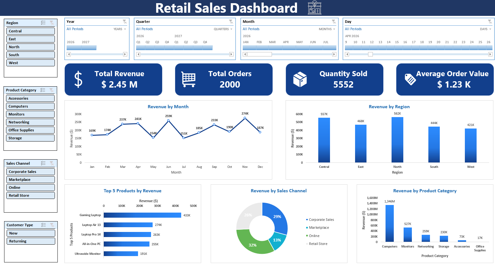

# Retail Sales Dashboard

Excel-based interactive dashboard analyzing **12 months of retail sales data (2,000 orders)** for a technology products and office supplies company.

The dashboard development was completed as a hands-on learning exercise based on the Marg Analytics tutorial, which was used as a reference for building the interactive Excel dashboard using PivotTables with provided dataset.



## Objective Project

The dashboard answers **6 core business questions** through interactive visualizations:

| # | Dashboard Component | Business Question |
|---|---------------------|-------------------|
| 1 | **Revenue by Month** | When are we strong/weak during the year? Is there a growth trend? |
| 2 | **Revenue by Region** | Which regions contribute most/least? Is revenue balanced geographically? |
| 3 | **Revenue by Sales Channel** | Which channels generate the most value? Are any underperforming? |
| 4 | **Revenue by Product Category** | Which categories drive revenue? Is there concentration risk? |
| 5 | **Revenue by Customer Type** | Are we acquiring new customers or relying on repeat buyers? |
| 6 | **Top 5 Products** | What are our best sellers? Is revenue concentrated in few products? |

## Filters

- **Region:** Central, East, North, South, West
- **Product Category:** Accessories, Computers, Monitors, Networking, Office Supplies, Storage
- **Sales Channel:** Corporate Sales, Marketplace, Online, Retail Store
- **Customer Type:** New, Returning
- **Time:** Year, Quarter, Month, Day

## Data Description

| Column | Description |
|--------|-------------|
| Order ID | Unique transaction identifier |
| Date | Transaction date |
| Region | Geographic region (Central, East, North, South, West) |
| Sales Channel | Corporate Sales, Marketplace, Online, Retail Store |
| Customer Type | New or Returning |
| Product Category | Accessories, Computers, Monitors, Networking, Office Supplies, Storage |
| Product | Specific product name |
| Salesperson | Salesperson name |
| Quantity | Units sold |
| Unit Price | Price per unit before discount |
| Discount | Discount rate (0%-20%) |
| Revenue | Final revenue after discount |

**Records:** 2,000 rows | **Date Range:** January 1 - December 31, 2026

## Project Structure

```
raw sales data_marg/
├── README.md
├── Retail_Sales_margs.xlsx      # Data and Dashboard
└── assets/
   └── result_sales_dashboard.png
```

## Process

1. **Data Preparation** : Loaded 2,000 rows of sales transactions (Jan-Dec 2026) into Excel. Validated 12 columns: Order ID, Date, Region, Sales Channel, Customer Type, Product Category, Product, Salesperson, Quantity, Unit Price, Discount, Revenue. Verified zero missing values and zero duplicates.

2. **KPI Calculation** : Built 4 summary cards: Total Revenue, Total Orders, Quantity Sold, Average Order Value.

3. **Chart Development** : Created 5 visualizations mapped to business questions: monthly trend, region, category, channel, customer type, and top 5 product list.

4. **Filter Setup** : Added interactive filters for Region, Product Category, Sales Channel, Customer Type, Year, Quarter, Month, and Day to enable drill-down analysis.

5. **Analysis & Insights** : Interpreted dashboard outputs to identify patterns, risks, and opportunities.

## Insights

| # | Component | Key Finding |
|---|-----------|-------------|
| 1 | **Revenue by Month** | Flat across the year, $168K in January to $187K in December. November peaked at $274K, June at $259K. May and July were the slowest months. Q2 and Q4 outperformed Q1 and Q3, in line with typical budget-cycle timing. |
| 2 | **Revenue by Region** | Fairly even split, 17% to 23% per region. North leads at $562K (22.9%), West trails at $421K (17.2%), a 5.7-point spread. Not a region carrying or dragging results. |
| 3 | **Revenue by Sales Channel** | Online brings in the most raw revenue ($792K, 32.3%), but Corporate Sales converts better: 29.3% of revenue from 16.7% of orders. Marketplace lags, 18.5% of orders but only 12.7% of revenue. |
| 4 | **Revenue by Product Category** | Computers account for 54.9% ($1.35M), more than every other category combined. Monitors are second at 21.5% and growing 49% from Q1 to Q4. Storage is down 7.8%. |
| 5 | **Revenue by Customer Type** | Returning customers drive 68.6% of revenue ($1.68M) versus 31.4% from new customers ($769K), and spend more per order ($1,284 vs. $1,116, a 15% gap). Every channel leans on repeat buyers for at least 63% of revenue. |
| 6 | **Top 5 Products** | The top 5 products make up 57.7% of total revenue. The Gaming Laptop alone accounts for 17.6%. Four of the five are computers; the Ultrawide Monitor is the outlier and a possible cross-sell angle. |

## Recommendations

- The Computers concentration is the biggest risk here. Over half of revenue sitting in one category rarely ends well when demand shifts, and Monitors' 49% growth suggests it's the natural category to lean into with bundles.

- Retention deserves more attention than it's getting. Returning customers aren't just the majority of revenue, they spend more per order, so a real loyalty program would protect the base the business already depends on.

- Marketplace is worth a hard look. Its order share and revenue share don't line up, and if fees or margins are thin there, it may not be worth the operational cost of running it.

- Whatever Corporate Sales is doing differently, whether it's pricing, account management, or deal size, is worth studying and testing on Online and Retail Store, since both channels have volume but weaker per-order value.

- New customer acquisition is thin at 31.4% of revenue, and Retail Store's 37% new-customer rate makes it the logical channel to push harder on for growth, since over-reliance on the existing base is a long-term risk if it ever churns.

### Further Update for Dashboard

| # | Recommendation | Missing Data |
|---|----------------|--------------|
| 1 | Review discount policy | Discount rates, margins |
| 2 | Close salesperson performance gap | Individual salesperson data |
| 3 | Quantify $ impact of each action | Cost structures, margins, elasticity |
